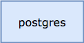
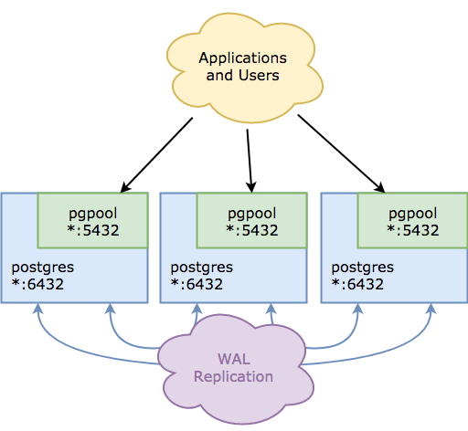

# Blacksmith PostgreSQL Forge

This Blacksmith Forge teaches a [Blacksmith Broker][broker] how to
deploy standalone and clustered [PostgreSQL][postgresql] service
deployments, which are useful for all things database.

## Deploying

To deploy this forge, you will need to add it to your existing
Blacksmith Broker manifest deployment, co-locating the
`postgresql-blacksmith-plans` job on the Blacksmith instance group.

Here's an example to get you started (clipped for brevity):

```yaml
releases:
  - name:    postgresql-forge
    version: latest

instance_groups:
  - name: blacksmith
    jobs:
      - name:    postgresql-blacksmith-plans
        release: postgresql-forge
        properties:
          plans:
            # your plans here
            # (see below)
```

The PostgreSQL Forge deploys postgresql using the `postgres` BOSH
release available from the [Cloud Foundry Community][pg-bosh].
The Forge itself specifes the correct URL and version of the
upstream BOSH release, in the deployment manifests, so unless you
lack access to the internet, you should be ok.

On the other hand, if you do need to upload the release,
Blacksmith is more than happy to upload it to the BOSH director on
your behalf.

For the Spruce users out there:

```
---
instance_groups:
  - name: blacksmith
    jobs:
      - name: blacksmith
        properties:
          releases:
            - (( append ))
            - name:    postgres
              version: latest
```

Finally, you'll need to define plans for Blacksmith to deploy.
The following sections discuss those in great detail.

## Standalone Topology

The `standalone` topology is as straightforward as they come: a
singe dedicated VM that runs postgresql bound on all interfaces, to
port 5432.

Here's a diagram to clear things up:



### Configuration Options

- *vm_type* - The name of a BOSH `vm_type` from your cloud-config.
  You can use this to size your PostgreSQL appropriate to your workload
  requirements, in terms of RAM and CPU.  Increasing the disk size
  via the VM type is not going to net you much of a gain (see
  the `disk_size` and `persist` options instead.

- *az* - A single BOSH availability zone name (per cloud-config),
  for your standalone node placement.  By default, the node will be
  put in `z1`.

- *network* - The name of the network to deply these instances to.
  This network should be defined in your cloud-config, and should
  be large enough to handle your anticipated service footprint.
  It does not need any static IP addresses.

  By default, VMs will be deployed into a network named
  `postgresql-service`.

- *disk* - The size of the persistent disk where PostgreSQL will
  store its data files.  By default, you get a 4G disk.  If, for
  whatever reason, you don't _want_ a persistent disk, you can set
  this to `0`.

### Example Configuration

A single standalone plan, persistent, with 4G of disk:

```
instance_groups:
  - name: blacksmith
    jobs:
      - name:    postgresql-blacksmith-plans
        release: postgresql-forge
        properties:
          plans:
            smalldb:
              type: standalone
              disk: 4_096
```

Here's a configuration that provides two different sizes of
persistent standalone, each in their own networks:

```
instance_groups:
  - name: blacksmith
    jobs:
      - name:    postgresql-blacksmith-plans
        release: postgresql-forge
        properties:
          plans:
            small:
              type: standalone
              net:  a-side
              disk: 4_096

            large:
              type: standalone
              net:  b-side
              disk: 16_384
```

## Clustered Topology

The `cluster` topology leverages PostgreSQL's native WAL
replication, and mixes in PGPoolII for query routing.  All nodes
in the cluster participate in replication.  Postgres itself runs
on the nonstandard port 6432, and PGPool assumes the canonical
5432 port.

Here's a diagram:



### Configuration Options

- *vm_type* - The name of a BOSH `vm_type` from your cloud-config.
  You can use this to size your PostgreSQL appropriate to your workload
  requirements, in terms of RAM and CPU.

- *azs* - A list of BOSH availability zone names (per
  cloud-config), across which to stripe the nodes.  By default,
  nodes will be put in `z1` and `z2`.

- *network* - The name of the network to deply these instances to.
  This network should be defined in your cloud-config, and should
  be large enough to handle your anticipated service footprint.
  It does not need any static IP addresses.

  By default, VMs will be deployed into a network named
  `postgresql-service`.

- *instances* - How many PostgreSQL instances to spin.  Must be at
  least 2, and defaults to 3.


## Example Configuration

Here's the configuration for the 3-node cluster pictured in the
topology digram above:

```
instance_groups:
  - name: blacksmith
    jobs:
      - name:    postgresql-blacksmith-plans
        release: postgresql-forge
        properties:
          plans:
            clustered:
              type:      cluster
              instances: 3
```

Here, we provide two different clustered configurations, varied
based on size.

```
instance_groups:
  - name: blacksmith
    jobs:
      - name:    postgresql-blacksmith-plans
        release: postgresql-forge
        properties:
          plans:
            medium:
              type:      cluster
              vm_type:   medium
              instances: 3

            large:
              type:      cluster
              vm_type:   large
              instances: 7
```

## Contributing

If you find a bug, please raise a [Github Issue][1] first,
before submitting a PR.


[1]: https://github.com/blacksmith-community/postgresql-forge-boshrelease/issues
[broker]: https://github.com/cloudfoundry-community/blacksmith
[postgresql]:  https://postgresql.org
